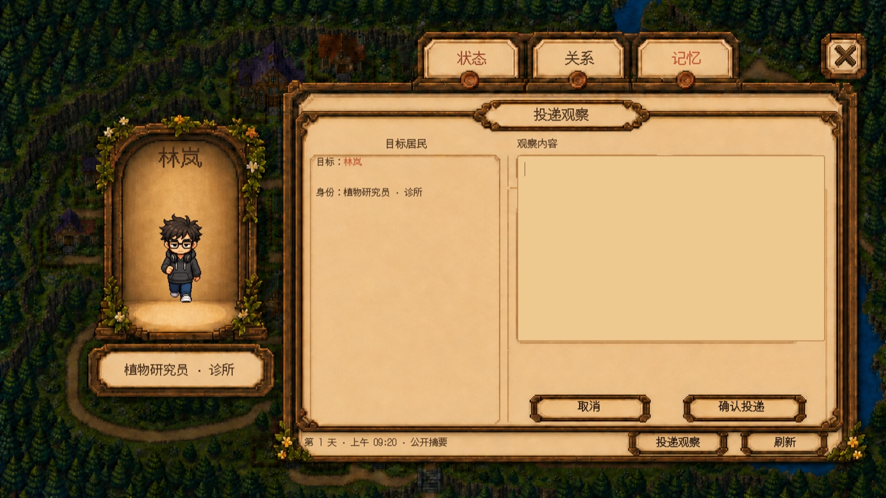
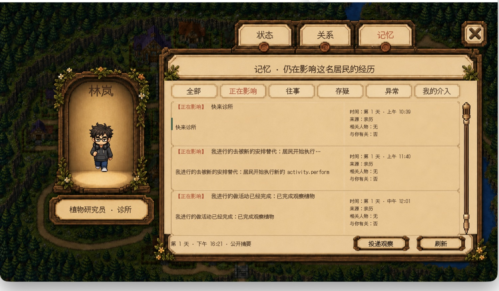
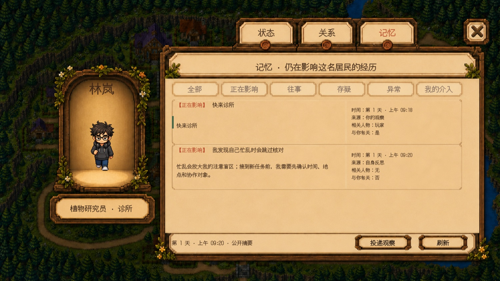
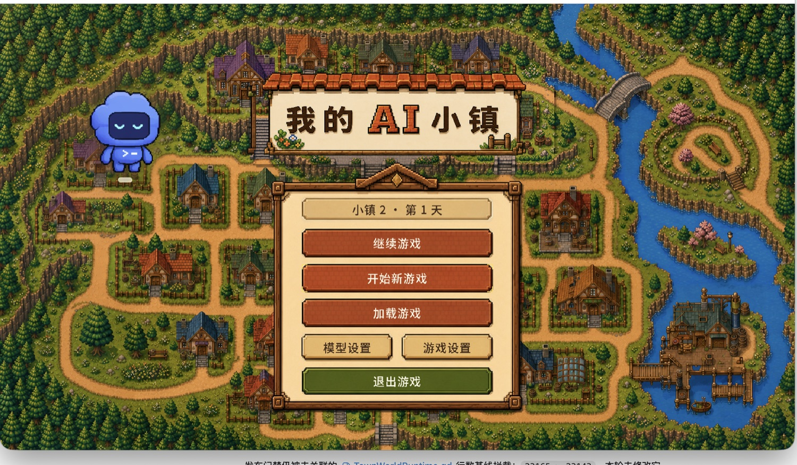
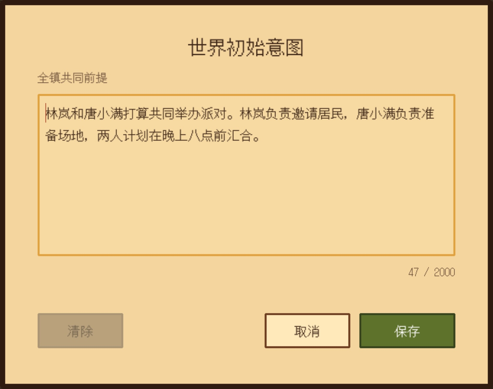

# EWS 里程碑运行时证据

本目录把六个讨论里程碑与具体代码、运行时画面和证据边界对应起来。

- `runtime-town-observation-entry.jpg`、`runtime-memory-before-fix.jpg`、`runtime-u0-entry-before-fix.jpg` 来自 2026-08-10 本机实际试玩截图，已裁去桌面和聊天窗口，仅保留游戏窗口。它们记录修复前的入口与故障现场。
- `runtime-natural-language-observation.jpg`、`runtime-self-reflection-memory.jpg`、`runtime-global-u0-form.jpg` 由当前分支加载正式 Godot UI 后运行时渲染。为避免调用真实模型，记忆内容使用确定性的公开摘要输入；它们证明界面和投影能力，不代替真人模型行为验收。
- “共同办派对”在真实模型下能否经 U-/U+ 形成反思并纠正漂移，仍是独立验收项。

## 1. 统一自然语言介入入口

对应 [Issue #1](https://github.com/Zxy876/my_ai_town/issues/1)。

代码：

- [`ResidentDetailScreen.gd`](../../../game/ui/resident_detail/ResidentDetailScreen.gd)：构建唯一的“投递观察”表单并提交原始自然语言。
- [`TownWorldAgentGateway.gd`](../../../game/world/integration/TownWorldAgentGateway.gd)：排队、唤醒、失败与审计入口。
- [`TownRuntimeObservationAdapter.gd`](../../../game/world/integration/TownRuntimeObservationAdapter.gd)：在下一次认知前附加观察并保持幂等。

## 2. 每个感知事件形成一阶记忆

对应 [Issue #2](https://github.com/Zxy876/my_ai_town/issues/2)。

代码：

- [`ResidentEvidenceQueue.gd`](../../../game/agent/memory/ResidentEvidenceQueue.gd)：把本轮感知写入居民私有证据队列。
- [`ResidentFormalMemoryBuilder.gd`](../../../game/agent/memory/ResidentFormalMemoryBuilder.gd)：按 observation id 建立一阶正式记忆和稳定来源。
- [`ResidentMemorySystem.gd`](../../../game/agent/memory/ResidentMemorySystem.gd)：在整理前持久化感知记忆并提供当前决策检索。

修复前现场：观察投递后，记忆子项没有形成可回放来源。

当前运行时投影：第一条来源为“你的观察”。

## 3. 按证据条件生成自身脆弱性反思

对应 [Issue #3](https://github.com/Zxy876/my_ai_town/issues/3)。

代码：

- [`MemoryOrganizer.gd`](../../../game/agent/memory/MemoryOrganizer.gd)：校验反思文本只能引用本轮真实来源。
- [`ResidentFormalMemoryBuilder.gd`](../../../game/agent/memory/ResidentFormalMemoryBuilder.gd)：建立独立的 reflection 根节点并防止重复反思。
- [`ResidentMemorySystem.gd`](../../../game/agent/memory/ResidentMemorySystem.gd)：在当前决策检索前接纳满足条件的反思。

当前运行时投影：第二条来源明确显示“自身反思”，与一阶“你的观察”分开。

## 4. U0 上移到世界初始化和存档层

对应 [Issue #4](https://github.com/Zxy876/my_ai_town/issues/4)。

代码：

- [`TownExperimentScenarioState.gd`](../../../game/world/integration/TownExperimentScenarioState.gd)：启动前配置、运行时拒绝 U0、激活、审计、保存和恢复。
- [`TownSessionUiService.gd`](../../../game/world/presentation/session/TownSessionUiService.gd)：把 Scenario 状态接入现有联合存档管线。
- [`TownSessionSaveCoordinator.gd`](../../../game/world/presentation/session/TownSessionSaveCoordinator.gd)：验证存档中的 experimentState。

修复前现场：主菜单没有可见的 U0 启动前入口。

当前运行时入口：U0 是世界启动前的“全镇共同前提”。

## 5. 尚未抵达的居民在首次认知时补收 U0

对应 [Issue #5](https://github.com/Zxy876/my_ai_town/issues/5)。

代码：

- [`TownWorldAgentGateway.gd`](../../../game/world/integration/TownWorldAgentGateway.gd)：把 `RUNTIME_OBSERVATION_TARGET_UNAVAILABLE` 识别为正常延迟，不把 U0 标记为失败。
- [`TownExperimentScenarioState.gd`](../../../game/world/integration/TownExperimentScenarioState.gd)：保留每名居民的待交付状态，首次可用认知再附加。
- [`GameFlowHost.gd`](../../../game/world/presentation/game_flow/GameFlowHost.gd)：启动失败保留初始意图，成功进入世界后才清除。

故障现场与启动前输入面：

物理抵达与首次认知之间的延迟交付是后台状态迁移，不能仅凭静态图片证明；对应验收由 `experiment_scenario_state_test.gd`、`town_runtime_observation_wake_test.gd` 和存档往返测试提供。

## 6. U0 成为全镇共同长期记忆

对应 [Issue #6](https://github.com/Zxy876/my_ai_town/issues/6)。

代码：

- [`ResidentModelAssignmentScreen.gd`](../../../game/ui/resident_model_assignment/ResidentModelAssignmentScreen.gd)：移除局部居民选择，只保留“全镇共同前提”输入。
- [`GameFlowHost.gd`](../../../game/world/presentation/game_flow/GameFlowHost.gd)：把一次自然语言输入扩展到本次确认的全部居民。
- [`town_ui_runtime_test.gd`](../../../game/tests/town_ui_runtime_test.gd)：确认 15 名居民收到相同原文且完整覆盖居民名单。

